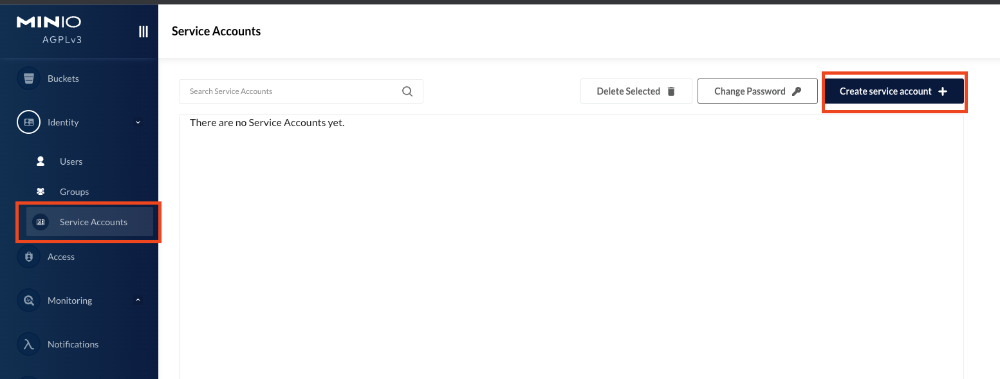
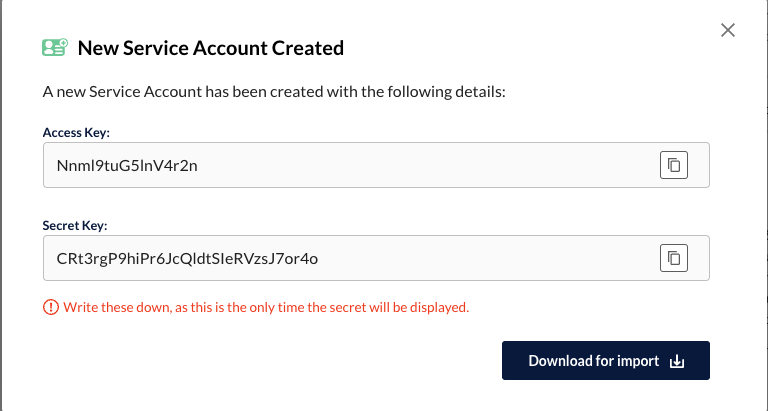
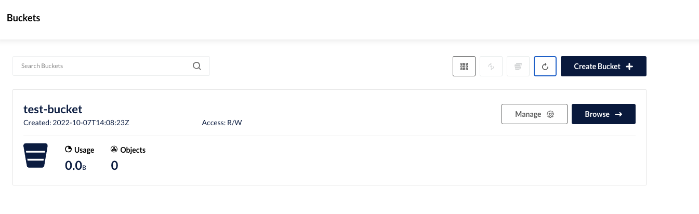
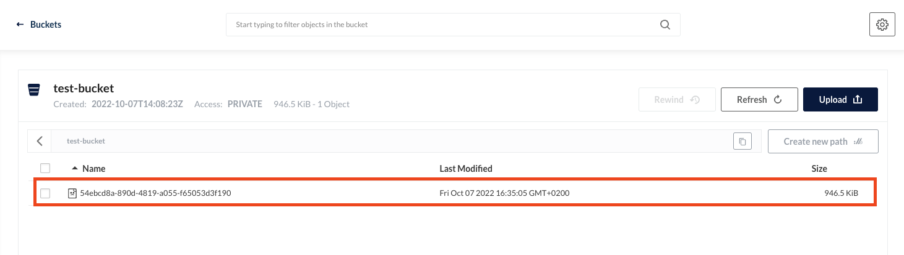

# How to use this project

## Requirements to run this project
1. Knowing how to run go applications locally and having some basic understanding of the go cli and go modules system
2. Having docker installed in your machine
3. Having make install in your machine

## Set up the s3 server
```bash
$ make s3-server
```
You should get this output
```bash
MinIO Object Storage Server
Copyright: 2015-2022 MinIO, Inc.
License: GNU AGPLv3 <https://www.gnu.org/licenses/agpl-3.0.html>
Version: RELEASE.2022-09-25T15-44-53Z (go1.18.6 linux/amd64)

Status:         1 Online, 0 Offline.
API: http://172.17.0.2:9000  http://127.0.0.1:9000
RootUser: admin
RootPass: changemeplease
Console: http://172.17.0.2:9090 http://127.0.0.1:9090
RootUser: admin
RootPass: changemeplease
```

Use the minio client which with this example project will be available at localhost:9090 and use the credential above to login.

Create a new service account and retrieve a new access-key and secret-key





Copy the values and replace the placeholder in the /cmd/s3/main.go and the /cmd/server/main.go file

```go
const (
	s3url      = "localhost:9000"
	accessKey  = "Access Key"
	secretKey  = "Secret Key"
	region     = "eu-west-1"
	bucketName = "test-bucket"
)
```
Run the executable to create the bucket
```bash
$ make s3-create-bucket
```

If the bucket was correctly created you will get this output message
```bash
{"level":"info","time":"2022-10-07T16:08:23+02:00","message":"bucket created successfully"}
```

Go back to the client and refresh the home page. The newly created bucket should appear there.



The S3 server is ready to be used.

Notice that the minio server has been created with the --rm option that means that it will be removed if you kill the process. If that happens, this process needs to be repeated again to re-create the bucket.

## Set up the DB
Please download the migrate CLI binary for you machine and place it the ci/db/migrations folder. This is the [download page](https://github.com/golang-migrate/migrate/releases).

```bash
$ tree ci/db/migrations/
ci/db/migrations/
├── 1_create_file_tables.down.sql
├── 1_create_file_tables.up.sql
└── migrate

0 directories, 3 files
```

Start a postgres instance with docker

```bash
$ make postgres
```
Open another terminal and apply the migrations

```bash
make migrate
```

## Run the application
```bash
$ make run
```

Navigate to the http://localhost:3000/files/upload page and upload a file. Check the server logs to be sure that everything is working fine. If you get a 200 Ok response,
you should see your first entrance in the bucket.





